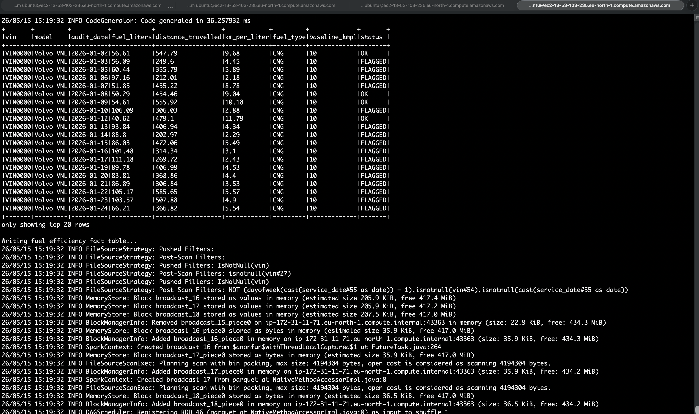
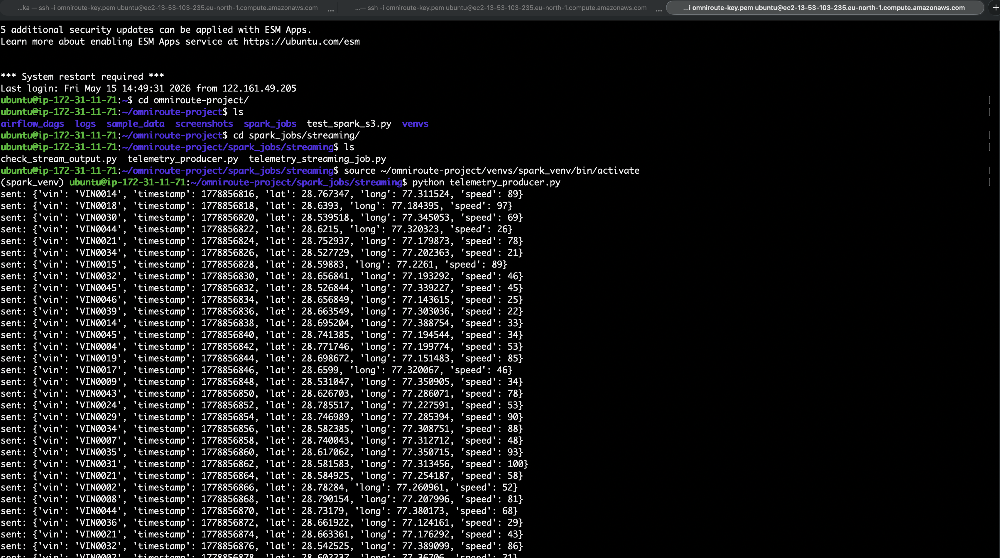
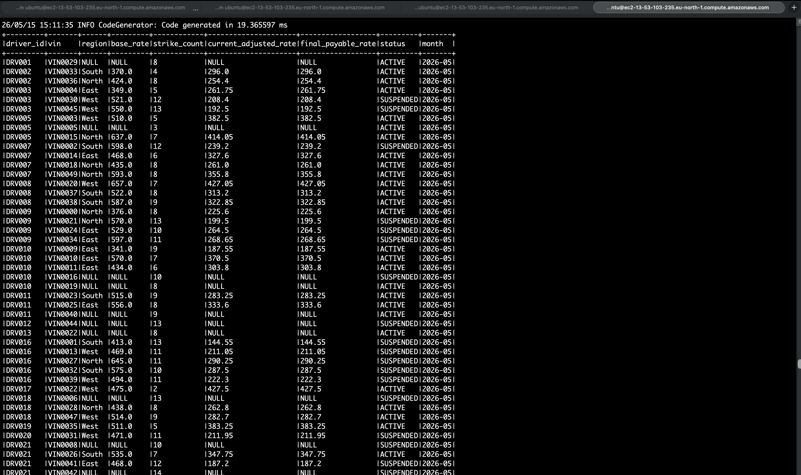
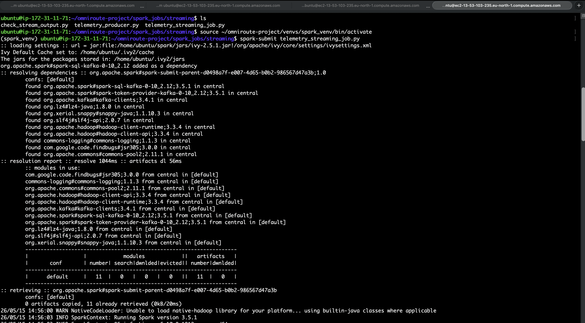
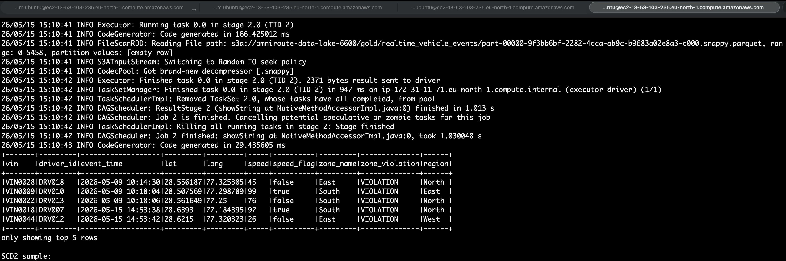
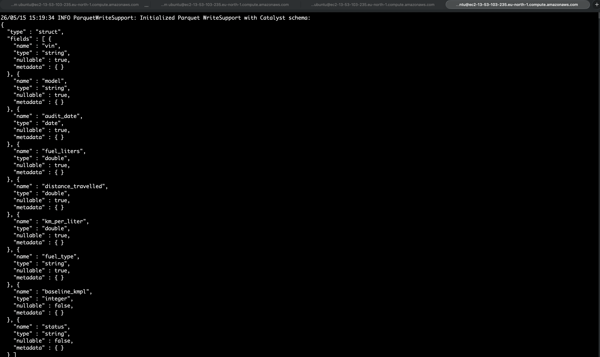
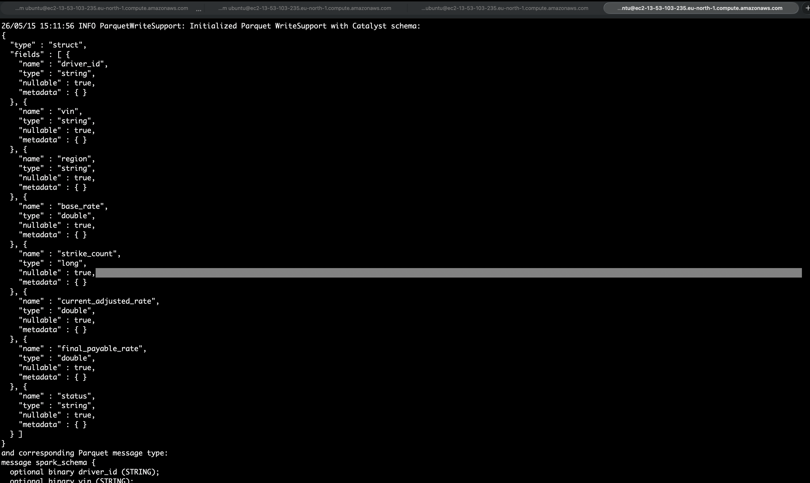
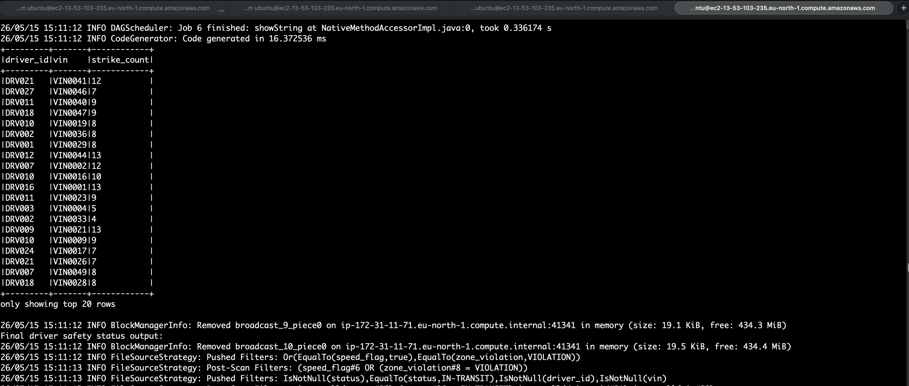
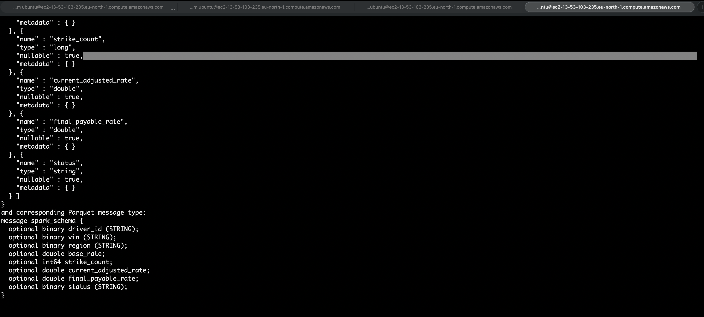
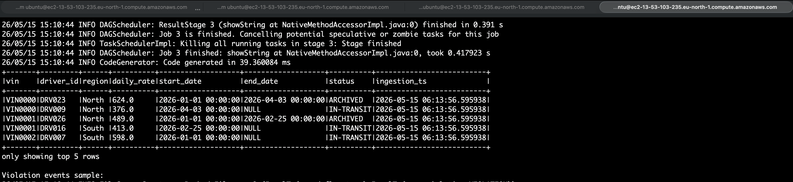

# Spark Pipeline Outputs

This document contains sample outputs generated from the Spark batch and streaming pipelines implemented in the OmniRoute platform.

---

# 1. Fuel Efficiency Auditing Output

This output demonstrates:

- Distance calculation using window functions
- KM/L efficiency computation
- Baseline threshold comparison
- Fuel anomaly detection
- Maintenance-day filtering

## Spark Job

```text
spark_jobs/batch/fuel_efficiency_gold.py
```

## Output Screenshot



---

# 2. Kafka Telemetry Producer Output

This output demonstrates:

- Telemetry event generation
- Kafka message publishing
- Real-time telemetry simulation

## Spark Job

```text
spark_jobs/streaming/kafka_telemetry_producer.py
```

## Output Screenshot



---

# 3. Driver Safety Gold Output

This output demonstrates:

- Strike accumulation
- Dynamic rate adjustment
- Suspension logic
- Snapshot generation

## Spark Job

```text
spark_jobs/batch/driver_safety_status_gold.py
```

## Output Screenshot



---

# 4. Kafka Telemetry Stream Consumer Output

This output demonstrates:

- Spark Structured Streaming
- Kafka event consumption
- Real-time enrichment
- Streaming persistence

## Spark Job

```text
spark_jobs/streaming/telemetry_consumer.py
```

## Output Screenshot



---

# 5. Driver Status Speed & Zone Violation Detection

This output demonstrates:

- Speed violation detection
- Zone violation detection
- Driver safety event enrichment

## Spark Job

```text
spark_jobs/streaming/telemetry_consumer.py
```

## Output Screenshot



---

# 6. Fuel Efficiency Schema Validation

This output demonstrates:

- Fuel audit schema structure
- Typed Spark dataframe transformations
- Data standardization

## Spark Job

```text
spark_jobs/batch/fuel_efficiency_gold.py
```

## Output Screenshot



---

# 7. Driver Safety Schema Output

This output demonstrates:

- Driver safety dataframe schema
- Penalty engine structure
- Snapshot table schema

## Spark Job

```text
spark_jobs/batch/driver_safety_status_gold.py
```

## Output Screenshot



---

# 8. Driver Strike Count Aggregation

This output demonstrates:

- Driver strike aggregation
- GroupBy operations
- Business rule calculations

## Spark Job

```text
spark_jobs/batch/driver_safety_status_gold.py
```

## Output Screenshot



---

# 9. Driver Safety Schema Part 2

This output demonstrates:

- Extended schema validation
- Final dataframe structure
- Snapshot output validation

## Spark Job

```text
spark_jobs/batch/driver_safety_status_gold.py
```

## Output Screenshot



---

# 10. Driver Status Ingestion Step

This output demonstrates:

- Raw ingestion validation
- Streaming event ingestion
- Initial processing pipeline

## Spark Job

```text
spark_jobs/streaming/telemetry_consumer.py
```

## Output Screenshot



---

# Spark Engineering Concepts Demonstrated

- Spark Structured Streaming
- Kafka Integration
- Window Functions
- SCD Type 2 Modeling
- Snapshot Fact Tables
- Partitioned Data Lake Design
- Real-Time Event Processing
- Airflow-Orchestrated Batch Pipelines
- Business Rule Processing
- Operational Analytics
